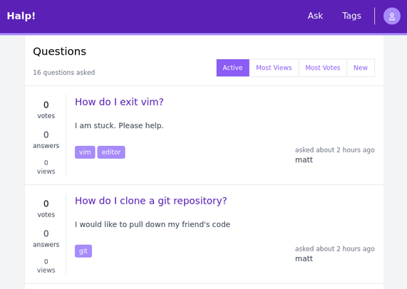

For a while now, I have had a handful of technologies on my radar, which I have
desired to explore and gain deeper insights into with hands on experience.
Specifically, I have been interested in learning and formulating an opinion on
Relay, Tailwind CSS, and TypeGraphGL.  A lot of technologies, even the ones I
listed, provide straightforward examples to highlight features.  However, I
find these examples do not truly expose the limitations you would later
encounter in a real world application.  As an approach to gain a stronger
understanding of particular technologies, I enjoy building moderately complex
projects with a variety of problems.  This forces myself to employ these
technologies in a manner I may practically encounter on the job or future
personal projects.

After some thought, I settled on the idea of creating a rudimentary [Stack
Overflow](https://stackoverflow.com/) clone.  This offered a lot of interesting
problems, such as authentication, form input, pagination, and sorting.  I
chipped away at this the last few months of the year and reached a point where
I felt I achieved a sufficient grasp of the technologies I sought to explore.
Additionally, I produced a roughly working clone, which has plenty of
opportunity for improvement.  Listed below provides of a glimpse of the running
project.

## How did I build it?

In short, the application is a React frontend and GraphQL backend running on
NodeJS with Koa backed by a Postgres database.  However, the more interesting
pieces of the application revolve around the various technologies I explored.

For the frontend, I specfically explored...

* [Relay](https://relay.dev/)
* [Tailwind CSS](https://tailwindcss.com/)
* [Zustand](https://github.com/pmndrs/zustand)

For the backend, I specifically explored...

* [TypeGraphQL](https://typegraphql.com/)
* [class-validator](https://github.com/typestack/class-validator)
* [MikroORM](https://mikro-orm.io/)

### [Relay](https://relay.dev/)

Relay offers itself as a GraphQL client, which was built by folks over at
Facebook.  I have had previous experience with [Apollo
Client](https://www.apollographql.com/docs/react/), which effectively serves
the same purpose, but offers a differing solution.  The biggest hurdle of Relay
involves its documentation and the initial setup.  However, once you conquer
those areas, then Relay offers an extremely pleasant development experience.
For the most part, it forces your hand at declaring your data dependencies
directly within your components, which provides components with single
responsibility and isolation.  Honestly, this made wiring up my components to
the backend a breeze once I got a handle of the Relay interfaces.
Additionally, Relay's automatic aggregation of data reduced the amount of
fetching my componeonts had to do to render, which provided a great plus.

### [Tailwind CSS](https://tailwindcss.com/)

Tailwind CSS has been receiving a lot of hype for some time and for good
reason, it allows developers to create aethestically pleasing web applications
with little effort.  It is a utility-first CSS framework, which you employ
through CSS class composition.  Overall, this technology worked wonders for me
and allowed me to quickly prototype the user interface with little effort.  The
only downside I encountered was that stringing together class names can create
quite the laundry list of concerns, which results in lengthy lines.

### [Zustand](https://github.com/pmndrs/zustand)

I did not pressure test this technology to the fullest, but it was new to me
and effectively solved my problem for React state management.  Overall, it
provided a clean API that lended itself to functional programming.
Additionally, the documentation provided very clear direction and recipes for a
number of use cases, which allowed me to put it into practice right away.

### [TypeGraphQL](https://typegraphql.com/)

This particular technology definitely won me over.  TypeGraphQL allows you to
define GraphQL schemas through classes with decorators over properties, create
queries and mutations through class methods with decorators, and introduce
validation on inputs through
[class-validator](https://github.com/typestack/class-validator) decorators.  As
a result, you end up with a concise and intuitive GraphQL implementation.

### [MikroORM](https://mikro-orm.io/)

MikroORM serves as an object-relational-mapping (ORM) solution, which similar
to TypeGraphQL, allows one to define database entities with classes and
decorators.  This allowed me to define my data model purely in TypeScript, then
utilize MikroORM's abstractions to persist and retrieve the data to my Postgres
database.  Overall, this allowed me to programmatically interface with my data
as TypeScript objects without having to concern myself with Postgres statements
and heavily expedited my development.  I found this particular project very
pleasant to use and very feature rich.

## Parting Thoughts

This project grew a little larger than I anticipated, but offered a lot of
interesting opportunities to explore that piqued my interest.  Each of these
technologies solve each of their problem domains well and I anticipate using
them again in the future.  I think others should consider entertaining these
solutions if it appears they may fit your need.

You can find Halp! at: [https://github.com/kubejm/halp](https://github.com/kubejm/halp)
