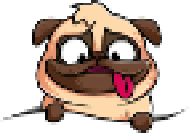

Recently, I have started tinkering around and building a game on the side, but
quickly found I needed sprites. I thought pixel art would be great for this,
but found doing this by hand can be rather time consuming and I tend to
produce mixed results of quality. So, I figured I could try to write a small
program that could assist me with creating pixel art. Ultimately, it would
take an image as input and produce a pixelated image as output.

I managed to write a simple Golang program to reasonably accomplish this.
Illustrated below is an example input and output.




I broke this down into a number of subproblems, which were new to me within
Golang. After solving each subproblem, the combined steps resulted in an
algorithm for converting an image to a pixelated representation.

The following highlights the subproblems and in combination the algorithm.

1. Consume an image
2. Build a data structure representing the image
3. Use the data structure as input to produce a pixelated representation
4. Save the pixelated representation to disk

## Consume an image

To begin working with the input image, it simply required registering the
image format with `image.RegisterFormat` and invoking `os.Open` to read the
image from the file system.

```go
image.RegisterFormat("png", "png", png.Decode, png.DecodeConfig)

file, err := os.Open(*in)
if err != nil {
  fmt.Fprintln(os.Stderr, "failed to open image")
  os.Exit(1)
}
defer file.Close()
```

## Building the data structure

I settled on iterating across the input image and constructing a
two-dimensional array of Pixel structs. The Pixel struct served as a
[RGBA color model](https://en.wikipedia.org/wiki/RGBA_color_model)
representation. Upon completion, I had an in-memory representation of the
image, which I could use for further processing.

```go
type Pixel struct {
	R int
	G int
	B int
	A int
}
```

The following `getPixels` function receives a file (i.e. the input image) as
input, then iterates across the max width and max height and converts the
color at each pixel into a Pixel struct to build the two-dimensional array.

```go
func rgbaToPixel(r uint32, g uint32, b uint32, a uint32) Pixel {
	var pixel Pixel

	pixel.R = int(r / 257)
	pixel.G = int(g / 257)
	pixel.B = int(b / 257)
	pixel.A = int(a / 257)

	return pixel
}

// https://stackoverflow.com/a/41185404
func getPixels(file io.Reader) ([][]Pixel, error) {
	img, _, err := image.Decode(file)
	if err != nil {
		return nil, err
	}

	bounds := img.Bounds()
	width, height := bounds.Max.X, bounds.Max.Y

	var pixels [][]Pixel
	for x := 0; x < width; x++ {
		var row []Pixel
		for y := 0; y < height; y++ {
			color := img.At(x, y)
			row = append(row, rgbaToPixel(color.RGBA()))
		}
		pixels = append(pixels, row)
	}

	return pixels, nil
}
```

## Pixelating

To pixelate the data representation of the image, I effectively dissected the
image into square regions based on the provided `blockSize`. I represented
these regions in a separate two-dimensional array. Essentially, I collected
and averaged the pixels within each region to produce a color representation
for that region. Subsequently, I use the average pixels two-dimensional array
to build an image of the same size as the input image by filling each region
with the average color to provide a pixelated effect.

Listed below shows the `pixelate` function.

```go
func pixelate(pixels [][]Pixel, blockSize int) [][]Pixel {
	width, height := len(pixels), len(pixels[0])
	result := pixels

	averages := make([][]Pixel, int(width/blockSize)+1)
	for i := range averages {
		averages[i] = make([]Pixel, int(height/blockSize)+1)
	}

	for x := 0; x < width; x++ {
		for y := 0; y < height; y++ {
			avgX := int(x / blockSize)
			avgY := int(y / blockSize)
			averages[avgX][avgY] = averagePixels(averages[avgX][avgY], pixels[x][y])
		}
	}

	for x := 0; x < width; x++ {
		for y := 0; y < height; y++ {
			result[x][y] = averages[int(x/blockSize)][int(y/blockSize)]
		}
	}

	return result
}
```

## Save the pixelated representation

Lastly, I needed to turn the two-dimensional array representing the pixelated
image into an image file on the disk. This required constructing a blank
image, then iterating across the two-dimensional array and setting each pixel
with `img.Set`. To write the file to disk, I created a new file with
`os.OpenFile` and encode write the image to the file with `png.Encode`.

Listed below shows the entire implementation for `outputImg`.

```go
func pixelToRGBA(pixel Pixel) color.RGBA {
	var rgba color.RGBA

	rgba.R = uint8(pixel.R)
	rgba.G = uint8(pixel.G)
	rgba.B = uint8(pixel.B)
	rgba.A = uint8(pixel.A)

	return rgba
}

func outputImg(pixels [][]Pixel) {
	width, height := len(pixels), len(pixels[0])

	img := image.NewRGBA64(image.Rect(0, 0, width, height))

	for x := 0; x < width; x++ {
		for y := 0; y < height; y++ {
			pixel := pixels[x][y]
			img.Set(x, y, pixelToRGBA(pixel))
		}
	}

	f, _ := os.OpenFile("out.png", os.O_WRONLY|os.O_CREATE, 0600)
	defer f.Close()

	png.Encode(f, img)
}
```

## Try it out

I created a small implementation of this called pxl8, which provides a command
line interface for pixelating images with a variable block size.

You can find pxl8 at: [https://github.com/kubejm/pxl8](https://github.com/kubejm/pxl8)
